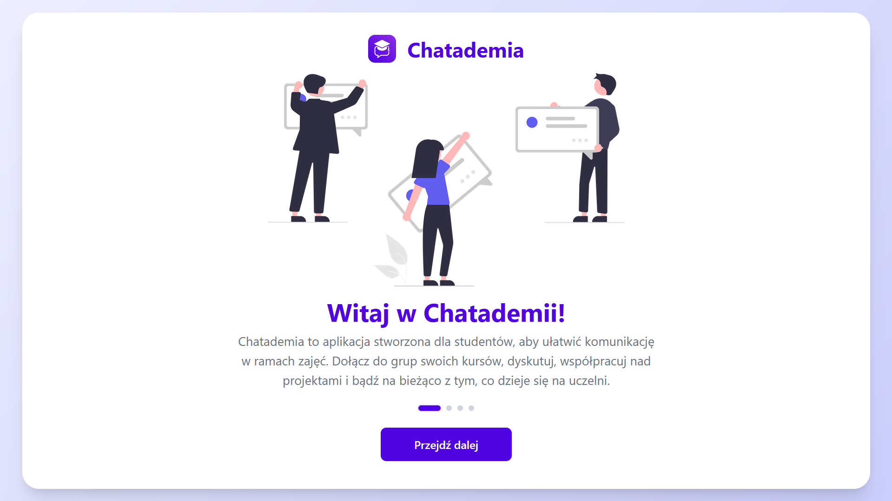
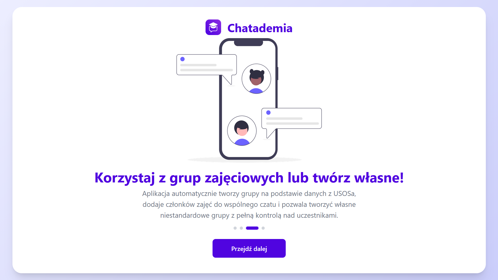
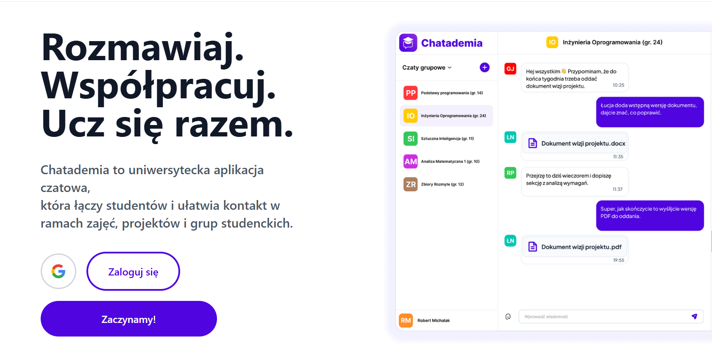
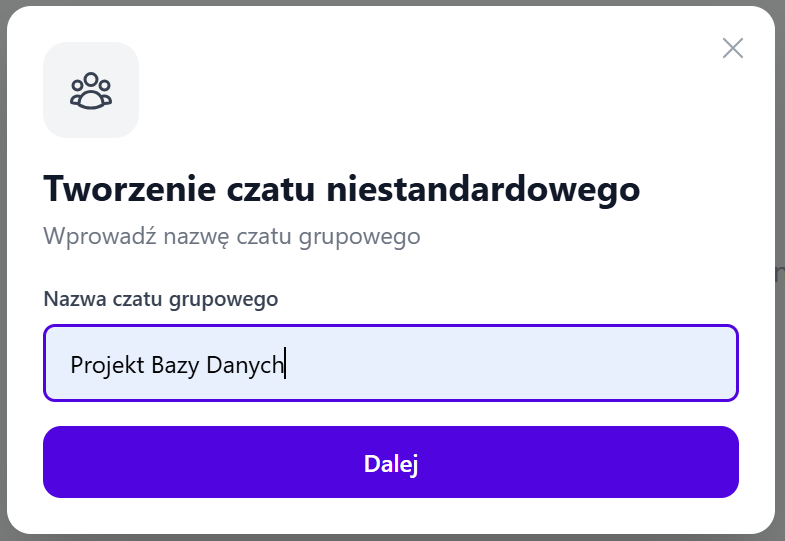
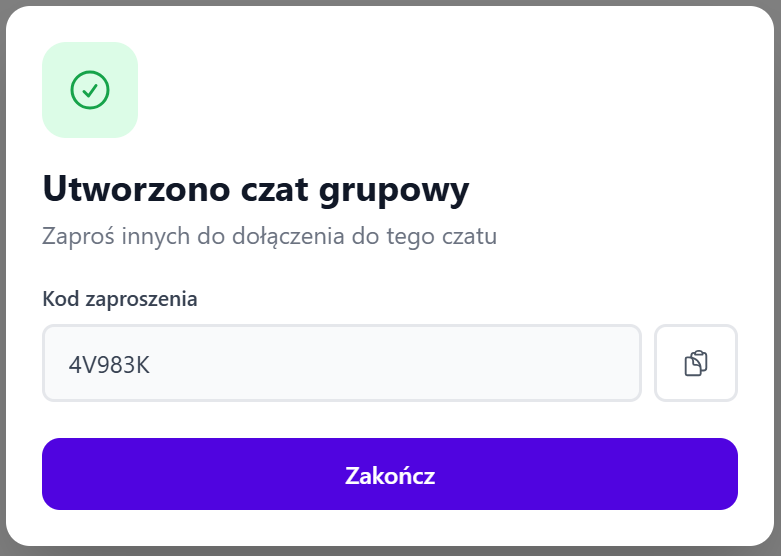
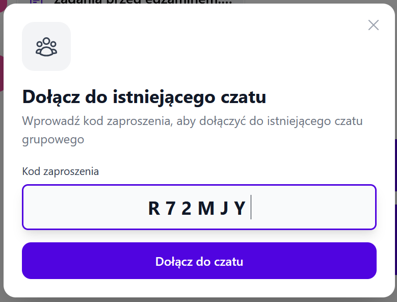
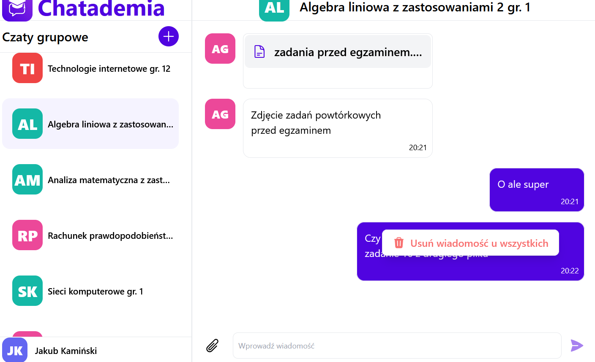
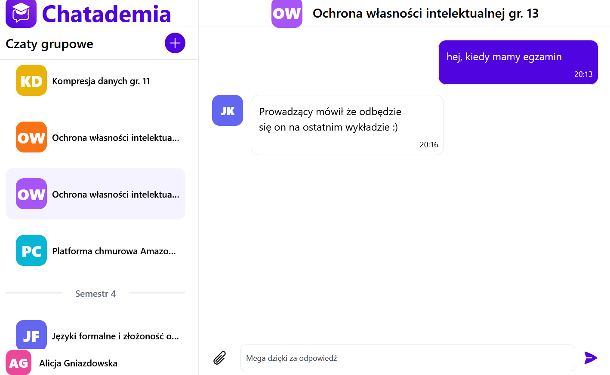
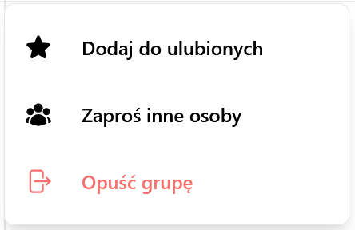
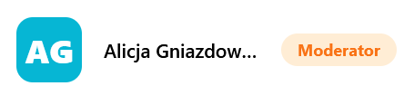

# Chatademia - Chat Web Service for academic students and more
### About project
The goal of our system is to enable the creation and maintenance of group chats with students participating in the same course groups.

Furthermore, the application allows for the creation of custom group chats, for example, for collaborative project work. Students can chat with each other and share files from class.The target group of our web application is students enrolled in USOS course groups as part of their university courses. Thanks to the custom group chat feature, the target group can be expanded to include people (including students) who are not affiliated with a USOS group. An application that facilitates contact with other people in a given course group is a significant convenience for our target group.

Furthermore, it should be noted that the application's core functionality is integration with the USOS system, which distinguishes our application from other, competing solutions.

### How to install
1. Follow the instructions from [a link to backend installation](server/README.md). Come back to upper directory
2. Follow the instructions from [a link to frontend installation](webapp/chatademia/README.md).
3. Open http://localhost:3000 to view it in your browser.
### Used technologies
Backend 
- .NET 10
- Docker
- PostgresSQL

Frontend
- Java Script
- React
- Node.js
### List of functionalities
New user registration and login (using USOS API) or Google email.

User data is stored in a secure database, integrated with data from the USOS system.

Each user has access to chats for their own class groups and the ability to create new ones and add other users to them.

Each user can send (and delate their own) text messages, send attachments, view chat history, add the group to their favorites, or leave it.

A moderator can kick users and delete groups for which they have permission. This ability is granted to the group creator upon its creation.

