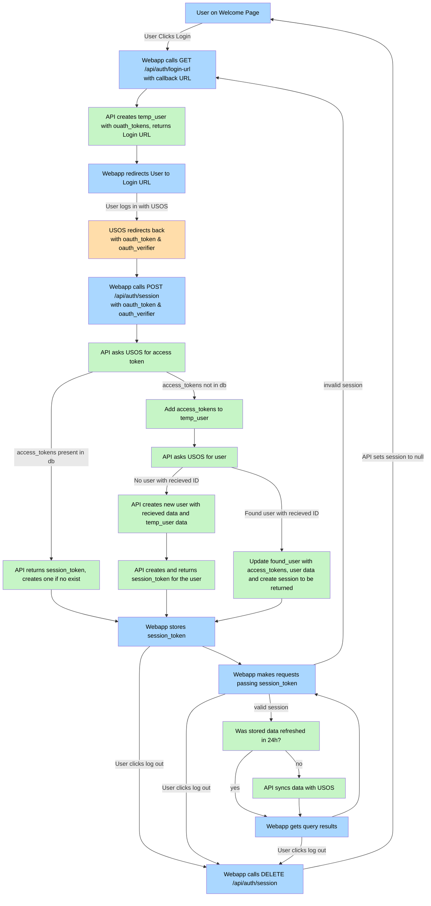

# The server is configured to run as a docker container
### Here is how to build it:

- Install Docker https://docs.docker.com/desktop/setup/install/windows-install/
- Run the docker engine (opening downloaded docker dektop should do it)
- Open a terminal and navigate to the `/server` directory of the project.
- Rename the `.env.example` to `.env` and fill in all the values
- `docker-compose up --build`
- The api should now be available at http://localhost:8080/, like http://localhost:8080/weatherforecast
- The documentation and visualization are now available at http://localhost:8080/scalar/v1

### When you're done testing or want to rebuild the image from scratch:
- `docker-compose down -v`

# API
### User flow: 

